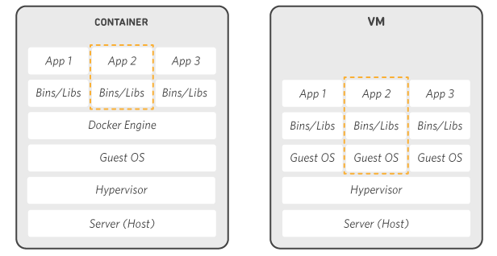
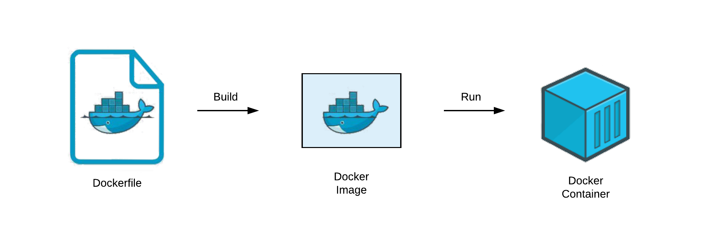
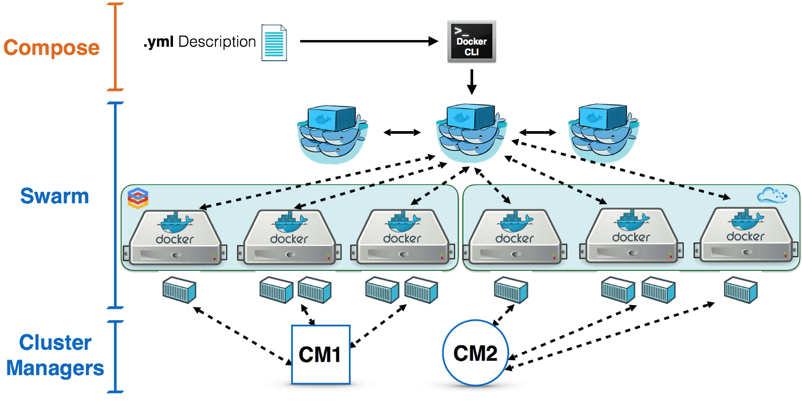
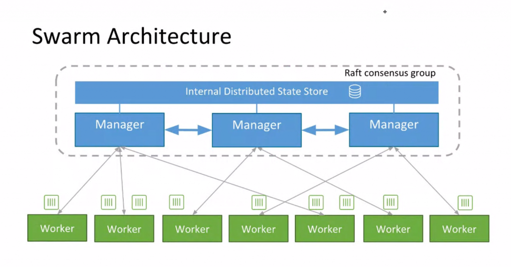

# Fundamentos de Docker (Contenedores)

Este curso tiene como objetivo introducirnos de forma práctica y sencilla a la técnologia de contenerización Docker.
    
Aprenderemos cómo utilizar docker en nuestros proyectos, estandarizando los ambientes de ejecución para los colaboradores de los proyecto y facilitando la implementación y escalamiento.

## Tabla de contenido
* [Docker](#docker)
* [Funcionamiento de Docker](#funcionamiento-de-docker)
* [Docker compose](#docker-compose)
* [Mejores practicas](#mejores-practicas)
* [Docker swarm](#docker-swarm)
* [Referencias](#referencias)

## Docker

[Docker](https://docs.docker.com/) permite estandarizar los entornos de ejecución de nuestras aplicaciones, encapsulando las librerias y dependencias dentro de un entorno controlado, dandonos la certeza que nuestro código se ejecutará igual en cualquier entorno con docker instalado en el que se ejecute.

Docker es un sistema operativo (o runtime) multi plataforma que nos permite empaquetar software en unidades estandarizadas llamadas contenedores y nos proporciona un conjunto sencillo de comandos para administrarlos. 



A diferencia de una maquina virtual (VM), los contenedores virtualizan únicamente el software, ademas que cada contenedor contiene únicamente lo necesario para que el software se ejecute (bibliotecas, herramientas de sistema y el código fuente). Esto permite que los contenedores sean más ligeros que las maquinas virtuales.

El instalador se puede [descargar desde su página oficial](https://docs.docker.com/engine/install/).

### Docker hub

[Dockerhub](https://hub.docker.com/) es un servicio de registro de repositorios proporcionado por Docker Inc.

Es una plataforma similar a github donde podemos:
* Encontrar imágenes de contenedores
* Integración con GitHub y Bitbucket
* Publicar imágenes

## Funcionamiento de docker

Podemos resumir el funcionamiento de docker en 3 elementos y dos procesos.

Dockerfile → ```docker build``` → Imagen → ```docker run``` → Contenedor



### Dockerfile

Es un archivo de texto plano que define las instrucciones necesarias para que nuestra aplicación se ejecute, el Dockerfile es transformado por el engine de docker en una imagen (```docker build```) .

Al ser archivos de texto plano los Dockerfile pueden ser incluidos en nuestros proyectos y distribuidos usando [github](https://github.com/).

```docker
# Dockerfile 
FROM ubuntu:16.04
# MAINTAINER someuser@somedomain.com
RUN apt-get update
RUN apt-get install –y mysql
CMD echo "My first image created."
```

Cada línea de nuestro Dockerfile será interpretada y generará una imagen intermedia en cache.

**Comandos básicos del Dockerfile**

* FROM → Indica la imagen base que usaremos
* RUN → Ejecuta comandos dentro de nuestra imagen
* CMD → Ejecuta nuestra aplicación
* EXPOSE → Expone puertos de nuestra imagen
* COPY → Copia archivos desde el contexto de ejecución a la imagen

→ [Dockerfile reference](https://docs.docker.com/engine/reference/builder/)

### Imagen
Una imagen de Docker es una plantilla de solo lectura que define un contenedor. Cada imagen contiene el código fuente y las bibliotecas o utilidades del sistema que se hayan definido en el Dockerfile.

Al montar una imagen con el comando ```docker run``` se creará un contenedor.

**Comandos básicos para manejar imagenes**

```bash
docker pull <image>
docker build -t <image> .
docker images [OPTIONS]
docker rmi <image>
```

### Contenedor
Un contenedor de Docker es una imagen de Docker instanciada (en ejecución).

**Comandos básicos para manejar imagenes**

```bash
docker ps [OPTIONS]
docker run 
docker rm
docker start
docker stop
docker restart
docker logs 
docker exec
```

→ [Practica 1. Hello world](./ejercicios/E01/README.md)

→ [Practica 2. Dockerfile](./ejercicios/E02/README.md)

→ [Practica 3. Docker pull](./ejercicios/E03/README.md)

## Docker compose

**docker compose** es una herramienta de docker que nos permite usar archivos `*.yaml` (`docker-compose.yml`) para  definir como se ejecutaran los contenedores requeridos por nuestra aplicación (basada en servicios) facilitando la forma en la que se ejecutan.

→ [Practica 4. docker-compose.yml](./ejercicios/E04/README.md)

## Mejores practicas
* Generar contenedores efimeros
* Utilizar en lo posible imágenes oficiales 
* Entender el contexto de construcción (build)
* Utilizar .dockerignore para exceptuar archivos
* Desacoplar aplicaciones (Trabajar con microservicios)
* Usar multi-stage builds
* Instalar únicamente paquetes necesarios
* Minimizar el número de capas (RUN, COPY, ADD)
* Utilizar argumentos multilinea ("\")
* Optimizar comando RUN
* Evitar el uso del usuario root en comandos donde sea posible

→ [Mejores practicas para escribir Dockerfile's](https://docs.docker.com/develop/develop-images/dockerfile_best-practices/)

## Docker swarm

Es una herramienta para orquestar contenedores en clústers. Un clúster de swarm consiste en Docker Engine implementado en múltiples nodos.

Cada nodo ejecutará los servicios contenerizados en las replicas indicadas, permitiendo escalar de forma sencilla nuestras aplicaciones.



Existen  dos tipos de nodos:

* Manager → realizan la orquestación y la administración del clúster. 
* Worker → reciben y ejecutan tareas desde los nodos de administración.



→ [Practica 5. docker swarm](./ejercicios/E05/README.md)